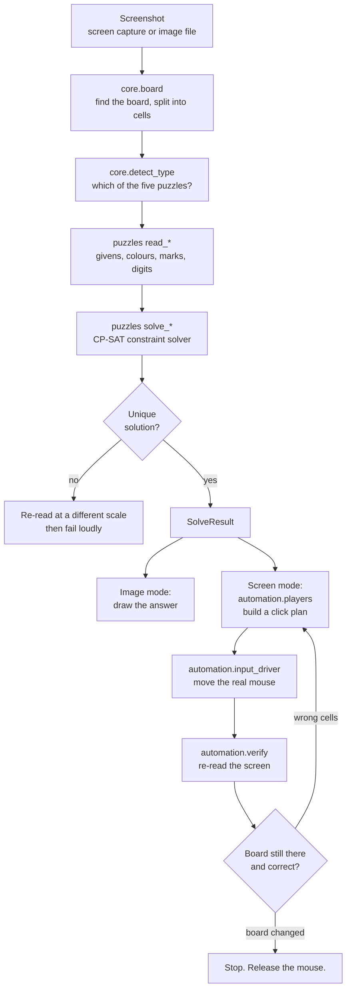

# LinkedIn Games Solver

[](https://github.com/yulunliu/linkedin-games-solver/actions/workflows/tests.yml)
[](LICENSE)
[](https://www.python.org/downloads/)

**Solve all five LinkedIn daily puzzles — Tango, Queens, Mini Sudoku, Zip and Patches — from a screenshot, or let it play them for you in the browser.**

*[中文說明 / Chinese version](README.zh-TW.md)*

No AI, no API key, no network access. Just OpenCV to read the board and a
constraint solver to work out the answer.

---

## What it does

| Mode | What you do | What it does |
|---|---|---|
| **Screen mode** | Open the puzzle in Chrome, click *Auto Solve* | Finds the board on screen, solves it, and fills in the answer with the mouse |
| **Image mode** | Drop in a phone screenshot | Solves it and shows you the answer as a picture |

Both modes live in the same window; a radio button switches between them.
The interface is available in **English and 中文**.

<!-- Add a screenshot or GIF here once you have one -->

### The five puzzles

| Puzzle | Rules in one line | How it is filled in |
|---|---|---|
| **Tango** | Equal suns and moons per row/column, never 3 in a row, obey the `=` and `×` marks | Click each cell 1–2 times |
| **Queens** | One crown per row, column and colour region; no two touching, even diagonally | Double-click each crown cell |
| **Mini Sudoku** | 6×6 Sudoku with 2×3 boxes | Click a cell, then press the number key |
| **Zip** | One path visiting every cell, through the numbered dots in order, without crossing walls | One continuous mouse drag |
| **Patches** | Cut the board into rectangles; each holds one label, its area matches the label's number, its proportions match the label's shape | One drag per rectangle |

---

## Quick start

### Just run it (Windows)

Download `PuzzleSolver.exe` from the [Releases](../../releases) page and
double-click. Nothing to install.

### From source

```bash
pip install -r requirements.txt
```

```bash
python run.py
```

### Command line

```bash
python -m linkedin_games_solver.ui.cli --image screenshot.png --out answer.png
```

The CLI never touches your mouse unless you add `--go`:

```bash
python -m linkedin_games_solver.ui.cli --go --slowdown 2.5
```

| Flag | Meaning |
|---|---|
| `--image FILE` | Solve an image file (never moves the mouse) |
| `--screen` | Capture the whole screen |
| `--region L,T,W,H` | Capture one rectangle of the screen |
| `--type KEY` | Force the puzzle type instead of auto-detecting |
| `--grid-size N` | Force the board size |
| `--go` | Actually play. Without it you only get a preview |
| `--slowdown N` | Delay multiplier — higher is slower and safer. Default `2.0` |
| `--out FILE` | Save the answer as an overlay image |

---

## How to use it on the web

1. Open the puzzle in Chrome and let it load fully.
2. Start `PuzzleSolver.exe` and pick **Play on screen**.
3. Click **Auto Solve**.
4. Take your hands off the mouse. It starts after a short delay and fills the board.
5. Move the mouse to a screen corner to abort at any time (PyAutoGUI's failsafe),
   or press the **Stop** button.

Things worth knowing:

- **It waits about a second before starting.** That is deliberate — it gives you
  time to release the mouse button so your click does not fight with its clicks.
- **It stops on its own.** After filling in the answer it re-reads the board. If
  the board has been replaced by the site's completion screen, it releases the
  mouse and stops instead of clicking at a screen that is no longer there.
- **Speed.** If the page cannot keep up with the mouse, set the speed to *slow*.
  Zip in particular needs the page to see every cell the pointer crosses.

---

## Design in one page



### Why it is built this way

**Recognition is the hard part, not solving.** A CP-SAT model for any of these
puzzles is 30 lines. Reading the board correctly from a JPEG that has been
through a phone's screenshot compression is where all the work went. So the
codebase is organised around that: `core/` extracts a grid, `puzzles/` reads
meaning out of the cells, and the solver is the small bit at the end.

**Succeeding is not the same as being correct.** This is the principle the whole
design hangs off. If recognition misses one `=` mark, the solver still returns a
perfectly valid-looking board — just the wrong one, silently. Three defences:

1. **Uniqueness as a completeness check.** These puzzles are published with
   exactly one solution. If the solver finds two, recognition must have missed a
   constraint. Tango, Sudoku and Patches all ask for a *second* solution and
   reject the answer if one exists.
2. **Sanity guards.** Queens checks that its colour regions are contiguous and
   that there are exactly *n* of them. Patches refuses to proceed on fewer than
   three labels. Both were added after a misread produced a confident, wrong,
   mouse-moving answer.
3. **Retry at a different scale.** Thresholds calibrated at 794 px stop working
   at 390 px. Rather than tune them per size, the pipeline normalises the board
   to a fixed scale, and re-runs at other scales and crops when the first attempt
   fails or is not unique.

**Never move the mouse on a guess.** Everything that drives the mouse can be run
as a dry run first, and prints exactly what it would click. The CLI defaults to
dry run. The tests use it to assert click counts without touching the mouse.

There is a fuller write-up, including the bugs that shaped each decision, in
[docs/DESIGN.md](docs/DESIGN.md).

---

## Layout

```
linkedin-games-solver/
├── run.py                       entry point (window)
├── run_cli.py                   entry point (console)
├── linkedin_games_solver/
│   ├── i18n.py                  English / 中文 strings
│   ├── core/                    generic vision, no puzzle knowledge
│   │   ├── image_io.py            Unicode-safe image read/write
│   │   ├── board.py               find the board, split it into cells
│   │   ├── digits.py              template-matching digit reader
│   │   ├── digit_templates.py     the templates themselves
│   │   ├── detect_type.py         which of the five puzzles is this?
│   │   └── result.py              SolveResult
│   ├── puzzles/                  one module per puzzle: read + solve
│   │   ├── __init__.py            registry and the normalise/retry pipeline
│   │   └── tango.py queens.py sudoku.py zip_path.py patches.py
│   ├── automation/               everything that touches the real screen
│   │   ├── capture.py             screen capture
│   │   ├── mapper.py              board cell -> screen pixel
│   │   ├── input_driver.py        the only file that moves the mouse
│   │   ├── players.py             turn an answer into a click plan
│   │   ├── verify.py              re-read the screen, decide whether to stop
│   │   └── board_watch.py         is our board still there? asked mid-plan
│   └── ui/
│       ├── app.py                 Tkinter window
│       ├── cli.py                 command line
│       └── settings.py            persisted preferences
├── tests/
│   ├── test_solvers.py            solver logic, no images
│   ├── test_recognition.py        real screenshots
│   ├── test_automation.py         click plans, dry run only
│   └── run_all.py
└── docs/
    ├── DESIGN.md                  why it is built this way
    ├── ARCHITECTURE.md            module by module
    ├── USAGE.md                   step by step
    └── ROADMAP.md                 what is next
```

Every source file is commented in **English and 中文 together**, paragraph by
paragraph, with the tricky lines called out individually.

---

## Tests

```bash
python tests/run_all.py
```

Ten suites, all offline, no mouse movement:

- **`test_compat.py`** — that the declared Python 3.9 support is real. Checks
  every file parses at the minimum version and that no PEP 604 union is
  evaluated at runtime. Added after 1.0.0 shipped with one that crashed on 3.9.
- **`test_solvers.py`** — solver logic on hand-built puzzles, plus the
  uniqueness guards. Each test re-checks the rules independently of the solver,
  so a solver that is wrong in the same way as its own validation cannot pass.
- **`test_digits.py`** — that a digit is either read correctly or reported as
  unreadable, never silently read as a different digit. Checked across ten fonts
  and with no system font at all.
- **`test_recognition.py`** — real screenshots. Every fixture is a bug that
  actually happened: the pastel Queens board misfiled as Patches, the Tango grid
  one column off, the dashed Patches labels whose white gaps read as digits.
- **`test_zip_dots.py`** — dot detection, hole extraction, and the refusal to
  guess a number it could not read. Ground truth was read off the image by eye.
- **`test_board_guard.py`** — that the mid-plan guard never fires on a real
  board in any state, does stop when the board is replaced, and never interrupts
  a drag in flight.
- **`test_automation.py`** — click plans in dry run: resuming a half-finished
  board, clearing misplaced crowns, drag interpolation, and that image mode runs
  without the screen-mode packages installed.
- **`test_settings.py`** — a malformed saved region is dropped rather than
  reaching the GUI and crashing it at startup.
- **`test_image_io.py`** — reading and writing images always returns a value,
  never raises: a directory, a locked file, an unwritable path all fail cleanly.
- **`test_cli.py`** — `--region` parsing: malformed text or a non-positive
  width/height gets a clear message, not a raw exception.

---

## Requirements

Python 3.9+, and:

| Package | Used for | Needed by |
|---|---|---|
| `opencv-python` | all image processing | both modes |
| `numpy` | arrays | both modes |
| `ortools` | CP-SAT constraint solver | both modes |
| `pillow` | image display in the GUI | both modes |
| `mss` | screen capture | screen mode only |
| `pyautogui` | mouse and keyboard | screen mode only |

Tkinter ships with Python. The two screen-mode packages are imported lazily, so
image mode runs with neither installed — this is enforced by a test, because it
used to be untrue.

Screen mode is Windows-only: it uses the Win32 API to focus the browser window
and to detect when you let go of the mouse.

---

## Building the .exe

```bash
pyinstaller --onefile --windowed --collect-all ortools --name PuzzleSolver run.py
```

And the console version:

```bash
pyinstaller --onefile --console --collect-all ortools --name PuzzleSolverCLI run_cli.py
```

`--collect-all ortools` is not optional. Without it PyInstaller misses OR-Tools'
native DLLs and the .exe dies with `DLL load failed while importing
cp_model_helper`.

---

## Known limitations

Stated up front rather than discovered later. Full detail in
[docs/ROADMAP.md](docs/ROADMAP.md).

- **Verify-and-retry covers Tango, Queens and Sudoku only.** Zip and Patches are
  filled by dragging and their result is not read back.
- **A board that MOVES while filling is not detected.** Do not scroll the page or
  move the window during a run - every remaining click would land one cell off.
- **The command line `--go` has no board guard.** The GUI stops when the board is
  replaced; the CLI does not.
- **Closing the window mid-fill can leave the mouse button held down.** Press
  Stop first.
- **The GUI needs `mss` installed even for image mode**, and a corrupt settings
  file stops it starting at all.
- **Screen mode is Windows-only and assumes the board is on the primary
  monitor.**
- **Image mode thresholds are calibrated on iPhone 13 Pro screenshots.**
- **No test fixture contains a 0 or a 7.** Those two digit templates are
  font-derived and have never been checked against a real board.
- **Recognition and solver error messages are fixed bilingual strings**, so they
  ignore the language setting.

## Getting help / reporting a bug

Open an [issue](../../issues). For a recognition problem, the single most useful
thing you can attach is **the screenshot the program saw** — press **Save** in
screen mode and it writes exactly that. Every bug in this project was fixed by
turning such a screenshot into a test fixture.

[CONTRIBUTING.md](CONTRIBUTING.md) has the details, including how to re-derive
the digit templates if your device draws numbers differently.

## Notes

This is a personal project for solving puzzles I would otherwise solve by hand.
It reads pixels off my own screen and moves my own mouse; it does not talk to
LinkedIn's servers, read network traffic, or use any API. Use it as you see fit
and at your own discretion.

Not affiliated with, endorsed by, or connected to LinkedIn.

## Licence

MIT. See [LICENSE](LICENSE).
