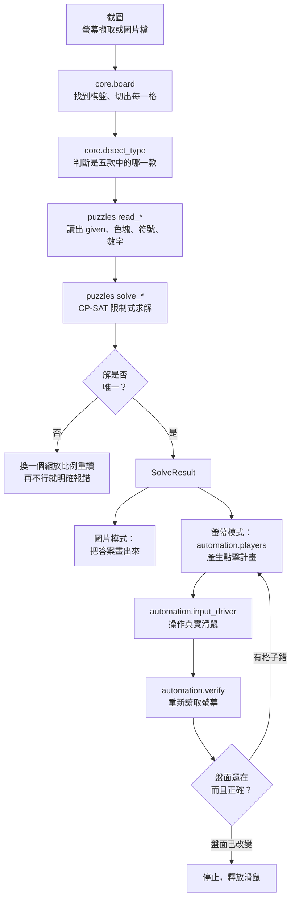

# LinkedIn Games Solver（LinkedIn 每日謎題自動求解）

**只要一張截圖，就能解開 LinkedIn 的五款每日謎題 —— Tango、Queens、Mini Sudoku、Zip、Patches；或是讓它直接在瀏覽器上幫你填完。**

*[English version / 英文說明](README.md)*

不用 AI、不用 API key、不連網路。只用 OpenCV 讀盤面，再用限制式求解器算出答案。

---

## 這個工具做什麼

| 模式 | 你要做的事 | 它會做的事 |
|---|---|---|
| **螢幕模式** | 在 Chrome 開好謎題，按「自動解答」 | 在螢幕上找到棋盤、算出答案，然後用滑鼠直接填完 |
| **圖片模式** | 丟一張手機截圖進來 | 算出答案，並把答案畫成圖給你看 |

兩種模式在同一個視窗，用一個選項就能切換。介面支援**中文與 English**。

<!-- 之後可在此放上程式畫面截圖或操作 GIF -->

### 五款謎題

| 謎題 | 一句話規則 | 填答方式 |
|---|---|---|
| **Tango** | 每列每行太陽月亮數量相同、不能三連、要滿足 `=` 與 `×` 符號 | 每格點 1～2 下 |
| **Queens** | 每列、每行、每個色塊各放一個皇冠，且兩兩不相鄰（含對角） | 每個皇冠格點兩下 |
| **Mini Sudoku** | 6×6 數獨，宮格為 2×3 | 點一格，再按數字鍵 |
| **Zip** | 一條路徑走完每一格，依編號順序經過圓點，且不能穿牆 | 一次連續拖曳 |
| **Patches** | 把盤面切成矩形；每個矩形內含一個標籤，面積等於標籤數字，長寬比例符合標籤形狀 | 每個矩形拖曳一次 |

---

## 快速開始

### 直接執行（Windows）

到 [Releases](../../releases) 下載 `PuzzleSolver.exe`，點兩下就能用，不需安裝任何東西。

### 從原始碼執行

```bash
pip install -r requirements.txt
```

```bash
python run.py
```

### 命令列

```bash
python -m linkedin_games_solver.ui.cli --image screenshot.png --out answer.png
```

命令列預設**不會**操作滑鼠，除非你加上 `--go`：

```bash
python -m linkedin_games_solver.ui.cli --go --slowdown 2.5
```

| 參數 | 意義 |
|---|---|
| `--image FILE` | 解圖片檔（絕不操作滑鼠） |
| `--screen` | 擷取整個螢幕 |
| `--region L,T,W,H` | 只擷取螢幕上的某個矩形範圍 |
| `--type KEY` | 指定謎題類型，不自動判斷 |
| `--grid-size N` | 指定棋盤格數 |
| `--go` | 真的執行填答。不加就只是預演 |
| `--slowdown N` | 速度倍率，越大越慢也越安全。預設 `2.0` |
| `--out FILE` | 把答案存成疊圖 |

---

## 在網頁上怎麼用

1. 在 Chrome 開好謎題，等頁面完全載入。
2. 啟動 `PuzzleSolver.exe`，選擇**在螢幕上自動填答**。
3. 按下**自動解答**。
4. 把手從滑鼠移開。它會等一小段時間才開始，然後自動填完整個盤面。
5. 想中止的話，把滑鼠移到螢幕角落（PyAutoGUI 的安全機制），或按**停止**。

幾件值得知道的事：

- **它會等大約一秒才開始動。** 這是刻意的 —— 讓你有時間放開滑鼠按鍵，
  否則你的點擊會跟它的點擊搶。
- **它會自己停下來。** 填完之後它會重新讀一次盤面。如果盤面已經被網站的
  完成畫面蓋掉，它就會釋放滑鼠並停止，而不是對著已經不存在的棋盤一直點。
- **速度。** 如果網頁跟不上滑鼠，把速度調成「慢」。Zip 特別需要網頁看到
  指標經過的每一格。

---

## 一頁看懂設計



### 為什麼這樣設計

**難的是辨識，不是求解。** 這五款謎題的 CP-SAT 模型每一個都只要 30 行左右。
真正花掉全部力氣的，是從一張被手機截圖壓縮過的 JPEG 裡正確讀出盤面。
所以整個程式就是圍繞這件事組織的：`core/` 負責抽出網格，`puzzles/` 負責從格子裡
讀出意義，求解器只是最後那一小塊。

**「跑得出答案」不等於「答案是對的」。** 這是整個設計的核心原則。
如果辨識漏掉一個 `=` 符號，求解器一樣會回傳一個看起來完全合法的盤面 ——
只是錯的，而且不會有任何警訊。三道防線：

1. **用唯一性當作辨識完整性的檢查。** 這些謎題出題時都保證只有一組解。
   如果求解器找得到第二組解，就代表辨識一定漏掉了某個條件。
   Tango、Sudoku、Patches 都會去要求「第二組解」，只要找得到就拒絕這個答案。
2. **合理性守門。** Queens 會檢查色塊是否連通、數量是否剛好 *n* 個；
   Patches 在標籤少於三個時直接拒絕往下做。這兩道都是在某次誤判產生了
   「很有自信、但完全錯誤、而且真的去動滑鼠」的答案之後才加上的。
3. **換個縮放比例重試。** 在 794px 校準出來的門檻值，到了 390px 就失效。
   與其為每個尺寸各調一組參數，不如把盤面正規化到固定尺度；第一次失敗或
   解不唯一時，再用其他縮放比例與裁切範圍重跑。

**絕不憑猜測去動滑鼠。** 所有會操作滑鼠的動作都可以先跑「預演」，
把打算點哪裡完整印出來。命令列預設就是預演；測試也是用它來驗證點擊次數，
完全不碰真實滑鼠。

更完整的說明（包含形塑每個決定的那些 bug）在 [docs/DESIGN.zh-TW.md](docs/DESIGN.zh-TW.md)。

---

## 檔案結構

```
linkedin-games-solver/
├── run.py                       進入點（視窗版）
├── run_cli.py                   進入點（命令列版）
├── linkedin_games_solver/
│   ├── i18n.py                  English / 中文 文字表
│   ├── core/                    通用視覺處理，不含謎題知識
│   │   ├── image_io.py            支援中文路徑的影像讀寫
│   │   ├── board.py               找到棋盤、切出每一格
│   │   ├── digits.py              樣板比對式數字辨識
│   │   ├── digit_templates.py     數字樣板本身
│   │   ├── detect_type.py         判斷這是五款中的哪一款
│   │   └── result.py              SolveResult
│   ├── puzzles/                  一款謎題一個模組：辨識 + 求解
│   │   ├── __init__.py            註冊表，以及正規化／重試流程
│   │   └── tango.py queens.py sudoku.py zip_path.py patches.py
│   ├── automation/               所有會碰到真實螢幕的東西
│   │   ├── capture.py             螢幕擷取
│   │   ├── mapper.py              棋盤格 -> 螢幕像素
│   │   ├── input_driver.py        唯一會移動滑鼠的檔案
│   │   ├── players.py             把答案轉成點擊計畫
│   │   └── verify.py              重讀螢幕，決定要不要停
│   └── ui/
│       ├── app.py                 Tkinter 視窗
│       ├── cli.py                 命令列
│       └── settings.py            設定的保存
├── tests/
│   ├── test_solvers.py            求解邏輯，不用圖片
│   ├── test_recognition.py        真實截圖
│   ├── test_automation.py         點擊計畫，只做預演
│   └── run_all.py
└── docs/
    ├── DESIGN.zh-TW.md            為什麼這樣設計
    ├── ARCHITECTURE.zh-TW.md      逐模組說明
    ├── USAGE.zh-TW.md             逐步操作說明
    └── ROADMAP.zh-TW.md           接下來要做什麼
```

每一個原始碼檔案都是**中英文並列**的註解，以段落為單位，
關鍵的那幾行會另外單獨說明。

---

## 測試

```bash
python tests/run_all.py
```

四組測試，全部離線、完全不動滑鼠：

- **`test_solvers.py`** —— 用手工編出來的題目測求解邏輯。每個測試都用
  **獨立於求解器之外**的方式重新檢查規則，這樣求解器就算寫錯、
  也不可能靠自我驗證通過。
- **`test_digits.py`** —— 驗證一個數字要嘛讀對、要嘛回報成讀不出來，
  絕不會默默讀成另一個數字。用十種字型、以及完全沒有系統字型的情況下檢查。
- **`test_recognition.py`** —— 真實截圖。這裡每一張圖都是真的發生過的 bug：
  被誤判成 Patches 的淡色系 Queens 盤面、整個偏一欄的 Tango 網格、
  白色縫隙被當成數字筆畫的虛線 Patches 標籤。
- **`test_automation.py`** —— 預演模式下的點擊計畫。接續填一半的盤面、
  清掉放錯位置的皇冠、拖曳路徑的插值，
  以及「圖片模式在沒有安裝螢幕模式套件時也能跑」。

---

## 環境需求

Python 3.9 以上，以及：

| 套件 | 用途 | 誰需要 |
|---|---|---|
| `opencv-python` | 所有影像處理 | 兩種模式 |
| `numpy` | 陣列運算 | 兩種模式 |
| `ortools` | CP-SAT 限制式求解 | 兩種模式 |
| `pillow` | GUI 內的圖片顯示 | 兩種模式 |
| `mss` | 螢幕擷取 | 只有螢幕模式 |
| `pyautogui` | 滑鼠與鍵盤 | 只有螢幕模式 |

Tkinter 是 Python 內建的。螢幕模式那兩個套件是延後載入的，
所以圖片模式在兩者都沒安裝的情況下也能跑 —— 這一點由測試守住，
因為它曾經並不成立。

螢幕模式僅限 Windows：它用 Win32 API 把瀏覽器視窗切到前景，
並偵測你什麼時候放開滑鼠。

---

## 打包成 .exe

```bash
pyinstaller --onefile --windowed --collect-all ortools --name PuzzleSolver run.py
```

命令列版：

```bash
pyinstaller --onefile --console --collect-all ortools --name PuzzleSolverCLI run_cli.py
```

`--collect-all ortools` 不能省略。少了它，PyInstaller 會漏掉 OR-Tools 的原生
DLL，執行檔一開就會死在 `DLL load failed while importing cp_model_helper`。

---

## 已知限制

先講清楚，而不是讓你之後自己發現。
完整說明見 [docs/ROADMAP.zh-TW.md](docs/ROADMAP.zh-TW.md)。

- **檢查補點只涵蓋 Tango、Queens、Sudoku。** Zip 與 Patches 是用拖曳填的，
  結果不會被讀回來，所以網頁沒跟上的拖曳既不會被偵測到、也不會補。
- **螢幕模式僅限 Windows，而且假設棋盤在主螢幕上。**
  接下來要支援雙螢幕與 DPI 縮放。
- **圖片模式的門檻值是照 iPhone 13 Pro 的截圖校準的。**
  其他裝置需要把門檻值改成從圖片本身推算，而不是寫死。
- **沒有任何測試素材含有 0 或 7。** 這兩個數字範本來自字型，
  從來沒有用真實盤面驗證過。
- **辨識與求解的錯誤訊息是固定的中英文串接字串**，沒有走 `i18n.py`，
  因此不受語言設定影響。

---

## 問題回報與求助

請開一個 [issue](../../issues)。如果是辨識問題，最有用的東西是
**程式實際看到的那張截圖** —— 在螢幕模式按**存圖**，它寫出來的就是那張。
這個專案裡每一個 bug，都是靠把這種截圖變成測試素材才修好的。

細節在 [CONTRIBUTING.md](CONTRIBUTING.md)，
包含「你的裝置數字畫得不一樣時，要怎麼重新產生數字範本」。

## 說明

這是一個個人專案，用來解那些我本來就會自己動手解的謎題。它讀的是我自己螢幕上的
像素、動的是我自己的滑鼠；它不會連上 LinkedIn 的伺服器、不讀網路封包、
也沒有使用任何 API。請自行斟酌使用。

本專案與 LinkedIn 無任何從屬、背書或合作關係。

## 授權

MIT。詳見 [LICENSE](LICENSE)。
