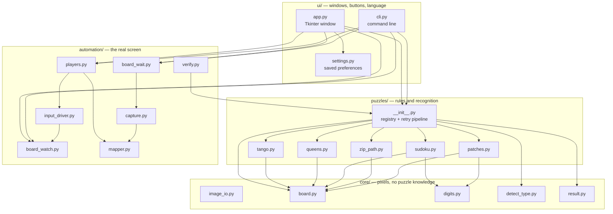

# Architecture

*[中文版 / Chinese version](ARCHITECTURE.zh-TW.md)*

Module by module. For *why* it is arranged like this, see [DESIGN.md](DESIGN.md).

---

## The layers



Dependencies only ever point **down and left**. `core/` imports nothing from the
project. `puzzles/` imports `core/`. `automation/` imports `puzzles/` for its
answer types but never the other way round. `ui/` imports everything and is
imported by nothing.

**One rule worth stating explicitly:** `input_driver.py` is the only file in the
project that moves the mouse. Everything else describes what it wants clicked.

---

## `core/` — generic vision

Nothing here knows that Tango or Queens exist. It knows about images, grids,
and digits.

### `image_io.py`

Unicode-safe image read/write.

```python
read_image(path)      # -> np.ndarray | None
write_image(path, image)
```

`cv2.imread` returns `None` for any path containing non-ASCII characters, with
no error and no exception — on a Chinese-language Windows machine, that is most
paths. These wrappers go through `np.fromfile` + `cv2.imdecode` instead, which
has no such limitation. Everything in the project reads images through here.

### `board.py`

Finds the board and splits it into cells.

```python
build_grid(image, n_hint=None) -> BoardGrid | None
```

`BoardGrid` carries `n`, `board_bbox`, `cell_boxes` and `cell_center(r, c)`.

The board is located by contour detection, then grid lines are found from
dark-pixel profiles along each axis. The board size comes from the **median
spacing** between detected lines, not the line count — a faint outer border is
detected inconsistently, which makes counts unreliable but leaves spacing
stable.

Several thresholds are tried in turn, since board rendering varies:

```python
_LINE_THRESHOLDS    = (215, 225, 230, 238, 244, 248)
_LINE_MIN_FRACTIONS = (0.45, 0.55, 0.65)
_SPACING_TOLERANCE  = 0.12
```

### `detect_type.py`

Decides which of the five puzzles an image contains.

```python
detect_type(image) -> "tango" | "queens" | "sudoku" | "zip" | "patches" | None
```

It samples cell interiors and reasons about colour statistics:

| Constant | What it separates |
|---|---|
| `QUEENS_FILLED_CELL_RATIO = 0.8` | Queens cells are filled corner to corner (~1.0); every other puzzle leaves white margins (≤0.23) |
| `NO_COLOR_RATIO = 0.006` | Sudoku and Zip boards are essentially colourless |
| `ZIP_DARK_RATIO = 0.05` | Zip's numbered dots are dark circles |
| `TANGO_HUE_RATIO = 0.75` | Tango is almost entirely orange + blue |

The corner-fill test came from a real misclassification: a pastel Queens board
had low enough saturation to look like Patches. Fill *coverage* separates them
where saturation does not.

### `digits.py` + `digit_templates.py`

Template-matching digit reader. Glyphs are normalised to 28×28 and compared
against templates captured from the app itself. No OCR engine, no model
download — the digits come from one font at a handful of sizes, so this is a
lookup, not a recognition problem.

### `result.py`

`SolveResult` — the one shape every solver returns:

| Field | Meaning |
|---|---|
| `ok` | did it produce a trustworthy answer |
| `puzzle_key` | which puzzle |
| `error` | why not, if `ok` is false |
| `grid` | board geometry, in the coordinates of the image passed in |
| `data` | the structured answer (queen positions, path, tiling, …) |
| `info` | human-readable lines for the UI |
| `overlay` | the answer drawn on the image, for image mode |

Because all five puzzles return this, the UI and the automation layer never
branch on puzzle type except to build a click plan.

---

## `puzzles/` — rules and recognition

One module per puzzle, each exposing `read_*` (image → puzzle) and `solve_*`
(puzzle → answer). They are registered flat:

```python
PUZZLES = {"tango": tango, "queens": queens, "sudoku": sudoku,
           "zip": zip_path, "patches": patches}
```

### `puzzles/__init__.py` — the pipeline

```python
solve_image(image, puzzle_key=None, n_hint=None) -> SolveResult
```

This is the single entry point for everything above it. It:

1. **Normalises scale.** Every threshold in the project was calibrated at
   `TARGET_BOARD_PIXELS = 794`; boards are rescaled to that before being read.
   Boards below `MIN_BOARD_PIXELS = 500` are upscaled rather than trusted.
2. **Detects the type**, unless one was forced.
3. **Reads and solves.**
4. **Retries** at other prescale factors and centre crops if that failed *or
   succeeded without a unique solution*:
   ```python
   _PRESCALE_STEPS = (1.0, 1.75, 2.5)
   _CROP_FRACTIONS = (1.0, 0.85, 0.72, 0.6, 0.5)
   ```
5. **Maps the answer back** to the original image's coordinates, so callers
   never see the internal rescaling.

Step 4's "succeeded but not uniquely" branch is the important one — see
[DESIGN.md](DESIGN.md#the-principle-succeeding-is-not-the-same-as-being-correct).

### The five modules

| Module | Reads | Solves with | Guard |
|---|---|---|---|
| `tango.py` | sun/moon icons, `=` and `×` edge marks | booleans + row/column sums + no-triple constraints | uniqueness |
| `queens.py` | colour regions, crowns, X marks | `AddExactlyOne` per row/column/region + adjacency | region count and contiguity |
| `sudoku.py` | given digits | `AddAllDifferent` per row/column/box | uniqueness |
| `zip_path.py` | numbered dots, walls | `AddCircuit` — a Hamiltonian path | inherently unique |
| `patches.py` | labels: digit + shape hint | exact cover by rectangles | ≥3 labels, uniqueness |

Notable details:

- **`queens.py`** groups region colours by *frequency*, not k-means. K-means
  randomly split regions between runs. Crowns are detected from a region inset
  by `ICON_INSET_RATIO = 0.28`, which excludes the grid lines — without that
  inset there is no threshold that separates crowns from empty cells.
- **`patches.py`** reads digits from the centre `DIGIT_REGION_RATIO = 0.62` of
  each badge and discards components below `DIGIT_MIN_HEIGHT_RATIO = 0.42`,
  because the white gaps between a dashed badge's stacked shapes otherwise read
  as digit strokes. Labels with no digit are legal and mean "any size".
- **`zip_path.py`** models the path as a circuit with a virtual arc from the end
  back to the start, which is how you express "Hamiltonian path" to CP-SAT.

---

## `automation/` — the real screen

### `capture.py`

```python
capture_screen()  capture_region(l, t, w, h)  default_region()  from_file_image(img)
```

All return a `ScreenShot(image, origin_x, origin_y)`. `from_file_image` wraps a
loaded file as a shot at origin `(0, 0)` — that is how image mode reuses the
whole pipeline unchanged, and also why a file's coordinates can never drive the
mouse.

### `board_wait.py`

```python
wait_for_board(capture_fn, should_continue=None) -> ScreenShot | None
wait_for_board_gone(capture_fn, should_continue=None) -> bool
```

Polls until a puzzle appears, and — between continuous-mode rounds — until
the previous one has left the screen, so the next round's detection can never
be re-triggered by its own leftover board still sitting in the capture
region. Both are cancellable through `should_continue`, the same pattern
`solve_image` uses for its own retry ladder.

### `mapper.py`

`BoardMapper` converts a board cell to a screen pixel, adding the capture
origin. Deliberately trivial and deliberately separate: it is the only place
where board space becomes screen space, so tests can substitute a fake grid and
get predictable coordinates.

### `board_watch.py`

```python
attach(driver, mapper, result, image) -> BoardWatch
```

Arms the mid-plan guard `input_driver.py`'s `_check_abort` asks between every
action: "is this still our board?" A structural recheck (cheap — this is not
a full re-solve), with a content-comparison fallback for Patches specifically,
where the puzzle's own drawn fill can defeat the structural grid-line check
partway through. That fallback can only ever *affirm* ("still ours, keep
going") or *decline* ("could not confirm, fall back to the plain structural
check") — never abort anything itself, so it can only make the guard more
lenient toward a board proven to still be ours, never less strict toward one
that is not. See [DESIGN.md](DESIGN.md) for the real incident and the
adversarial review that shaped this contract.

### `input_driver.py`

The only file that touches the mouse.

| Constant | Why |
|---|---|
| `SAME_SPOT_CLICK_GAP = 0.15` | pause between two clicks on one cell; the old 0.55 (above the OS double-click window) was calibrated against Tkinter, never the real page - see the constant's own comment for why 0.15 is covered by verify-and-retry |
| `DRAG_MAX_STEP_PX = 12` | drags are interpolated so the page sees every cell crossed |

Also here: `slowdown` (a global delay multiplier), `settle_after_move`,
`wait_for_mouse_release()` (nothing starts until the physical button is up),
`focus_window_at()` (Win32 `SetForegroundWindow`), a `stop()` flag that raises
`Aborted`, and `dry_run` mode which records every action into `driver.log`
without performing it.

Dry run is what makes the automation layer testable and what makes the CLI safe
by default.

### `players.py`

Turns a `SolveResult` into a `PlayPlan` — a list of described actions.

```python
build_plan(puzzle_key, mapper, data) -> PlayPlan | None
plan.description     # human-readable, printed before anything moves
plan.run(driver)
```

Per puzzle: Tango clicks each cell 1–2 times depending on what is there now
(the cycle is empty → sun → moon → empty); Queens double-clicks each crown cell,
single-clicks cells already showing an X, and clears misplaced crowns; Sudoku
clicks then presses a number key; Zip and Patches drag.

Plans are built from the board's *current* state, not from a blank board, so a
half-finished or interrupted board is resumed rather than restarted.

### `verify.py`

```python
verify(fresh_image, result, n_hint=None) -> VerifyReport
build_retry_plan(result, mapper, report) -> PlayPlan | None
```

Re-reads the screen after filling and reports **two distinct things**:

- `mismatches` — cells that are wrong → retry them
- `board_changed` — the board is no longer there → **stop and release the mouse**

That distinction is what stops the program clicking at the site's completion
screen after it has already won. `build_retry_plan` returns `None` when the
board has changed, so there is no way to keep clicking past the end.

---

## `ui/`

### `app.py`

The Tkinter window. Two modes on a radio button:

- **Play on screen** — capture, solve, fill in with the mouse, verify
- **Solve an image** — load a file, solve, show the answer drawn on it

Mouse-related options are disabled in image mode. Long work runs on a background
thread so the window stays responsive and the Stop button stays clickable. The
window is deliberately small (400 px wide, content needs 373 px) so it does not
get in the way while recording.

### `cli.py`

Same pipeline, no window. **Defaults to dry run** — it prints the plan and does
not move the mouse unless `--go` is given. `--image` never moves the mouse at
all, regardless of `--go`, because a file has no screen position.

### `settings.py`

Preferences persisted to `~/.linkedin_games_solver.json`: region, fullscreen,
speed, language, mode. Stored in the home directory rather than beside the
executable, so the app works from a read-only folder and settings survive
replacing the .exe. A corrupt settings file is ignored rather than fatal.

### `i18n.py`

A flat dictionary of ~80 keys, each with `en` and `zh`, and a `Translator` the
UI holds:

```python
t = Translator("en")
t("btn_solve")     # "Auto Solve"
```

---

## Adding a sixth puzzle

1. Write `puzzles/newgame.py` with `read_*` and `solve_*`, plus `KEY`,
   `NAME_EN`, `NAME_ZH`.
2. Register it in `PUZZLES` in `puzzles/__init__.py`.
3. Teach `core/detect_type.py` to recognise it.
4. Add a branch to `automation/players.py` for how it is filled in.
5. Add its name keys to `i18n.py`.
6. Add a solver test and a fixture-based recognition test.

Nothing in `core/`, `ui/`, `capture.py`, `mapper.py` or `input_driver.py` needs
to change.

---

## Related documents

- [DESIGN.md](DESIGN.md) — why it is built this way
- [USAGE.md](USAGE.md) — step by step
- [ROADMAP.md](ROADMAP.md) — what is next
- [EVOLUTION.md](EVOLUTION.md) — what has been built so far, by theme
