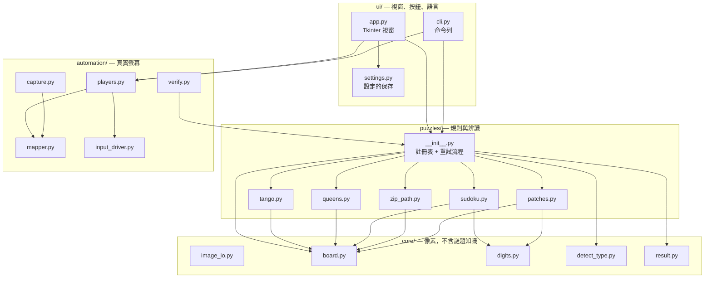

# 架構說明

*[English version / 英文版](ARCHITECTURE.md)*

逐模組說明。想知道**為什麼**這樣安排，請看 [DESIGN.zh-TW.md](DESIGN.zh-TW.md)。

---

## 分層



相依關係永遠只**往下、往左**。`core/` 不 import 專案裡的任何東西。
`puzzles/` import `core/`。`automation/` 為了答案型別而 import `puzzles/`，
但反過來絕不會。`ui/` import 所有東西，而且沒有任何東西 import 它。

**有一條規則值得明講：** `input_driver.py` 是整個專案裡唯一會動滑鼠的檔案。
其他所有東西都只是在描述「它希望哪裡被點」。

---

## `core/` —— 通用視覺處理

這裡沒有任何東西知道 Tango 或 Queens 存在。它只知道影像、網格、數字。

### `image_io.py`

支援中文路徑的影像讀寫。

```python
read_image(path)      # -> np.ndarray | None
write_image(path, image)
```

`cv2.imread` 對任何含非 ASCII 字元的路徑都會回傳 `None`，
沒有錯誤訊息、也不會丟例外 —— 在中文版 Windows 上，那幾乎是所有路徑。
這兩個包裝函式改走 `np.fromfile` + `cv2.imdecode`，沒有這個限制。
專案裡所有讀圖都經過這裡。

### `board.py`

找到棋盤，並切出每一格。

```python
build_grid(image, n_hint=None) -> BoardGrid | None
```

`BoardGrid` 帶著 `n`、`board_bbox`、`cell_boxes` 與 `cell_center(r, c)`。

棋盤是用輪廓偵測定位的，接著沿兩個軸從暗像素分布中找出格線。
棋盤格數是由偵測到的線之間的**間距中位數**推算出來的，不是線的數量 ——
很淡的外框會時有時無地被偵測到，這讓數量不可靠，但間距仍然穩定。

由於棋盤的繪製方式會變，門檻值會逐一嘗試：

```python
_LINE_THRESHOLDS    = (215, 225, 230, 238, 244, 248)
_LINE_MIN_FRACTIONS = (0.45, 0.55, 0.65)
_SPACING_TOLERANCE  = 0.12
```

### `detect_type.py`

判斷一張圖裡是五款謎題中的哪一款。

```python
detect_type(image) -> "tango" | "queens" | "sudoku" | "zip" | "patches" | None
```

它對格子內部取樣，然後對顏色統計做推論：

| 常數 | 用來分開什麼 |
|---|---|
| `QUEENS_FILLED_CELL_RATIO = 0.8` | Queens 的格子從角到角都填滿（約 1.0）；其他謎題都留白邊（≤0.23） |
| `NO_COLOR_RATIO = 0.006` | Sudoku 與 Zip 的盤面基本上沒有顏色 |
| `ZIP_DARK_RATIO = 0.05` | Zip 的編號圓點是深色圓形 |
| `TANGO_HUE_RATIO = 0.75` | Tango 幾乎整片都是橘色 + 藍色 |

「角落填滿」這個檢查來自一次真實的誤判：一個淡色系 Queens 盤面的彩度低到
看起來像 Patches。彩度分不開它們，但填滿**覆蓋率**可以。

### `digits.py` + `digit_templates.py`

樣板比對式數字辨識。字形正規化成 28×28，再跟從 App 本身擷取出來的樣板比對。
不用 OCR 引擎、不用下載模型 —— 這些數字來自同一套字型、只有幾種尺寸，
所以這是查表，不是辨識問題。

### `result.py`

`SolveResult` —— 所有求解器共用的唯一回傳型別：

| 欄位 | 意義 |
|---|---|
| `ok` | 有沒有產出一個可信任的答案 |
| `puzzle_key` | 是哪一款謎題 |
| `error` | 如果 `ok` 是 false，為什麼 |
| `grid` | 棋盤幾何，座標相對於傳入的原始影像 |
| `data` | 結構化答案（皇后位置、路徑、切法……） |
| `info` | 給介面顯示的人類可讀訊息 |
| `overlay` | 畫上答案的疊圖，給圖片模式用 |

因為五款謎題都回傳這個型別，介面層與自動化層除了「產生點擊計畫」之外，
完全不需要因謎題類型而分支。

---

## `puzzles/` —— 規則與辨識

一款謎題一個模組，各自提供 `read_*`（影像 → 題目）與 `solve_*`（題目 → 答案）。
註冊方式是扁平的：

```python
PUZZLES = {"tango": tango, "queens": queens, "sudoku": sudoku,
           "zip": zip_path, "patches": patches}
```

### `puzzles/__init__.py` —— 流程本體

```python
solve_image(image, puzzle_key=None, n_hint=None) -> SolveResult
```

這是上層所有東西的唯一入口。它會：

1. **正規化尺度。** 專案裡每個門檻值都是在 `TARGET_BOARD_PIXELS = 794`
   校準出來的；棋盤在被讀取之前一律先縮放到這個尺寸。
   小於 `MIN_BOARD_PIXELS = 500` 的棋盤會先放大，而不是直接相信它。
2. **判斷謎題類型**（除非有指定）。
3. **辨識並求解。**
4. 當上一步失敗、**或成功但解不唯一**時，用其他預放大倍率與中央裁切**重試**：
   ```python
   _PRESCALE_STEPS = (1.0, 1.75, 2.5)
   _CROP_FRACTIONS = (1.0, 0.85, 0.72, 0.6, 0.5)
   ```
5. **把答案映射回**原始影像的座標，讓呼叫端完全看不到內部的縮放。

第 4 步裡「成功但不唯一」那個分支是最重要的 ——
詳見 [DESIGN.zh-TW.md](DESIGN.zh-TW.md#核心原則跑得出答案不等於答案是對的)。

### 五個模組

| 模組 | 讀取 | 求解方式 | 守門 |
|---|---|---|---|
| `tango.py` | 太陽／月亮圖示、`=` 與 `×` 邊界符號 | 布林變數 + 列行總和 + 禁止三連 | 唯一性 |
| `queens.py` | 色塊、皇冠、X 記號 | 每列／行／色塊 `AddExactlyOne` + 相鄰限制 | 色塊數量與連通性 |
| `sudoku.py` | given 數字 | 每列／行／宮 `AddAllDifferent` | 唯一性 |
| `zip_path.py` | 編號圓點、牆 | `AddCircuit` —— 哈密頓路徑 | 本質唯一 |
| `patches.py` | 標籤：數字 + 形狀提示 | 矩形精確覆蓋 | 標籤 ≥3 個、唯一性 |

幾個值得注意的細節：

- **`queens.py`** 用**出現頻率**分群顏色，不用 k-means。
  k-means 會在不同次執行間隨機把某一塊切開。皇冠是從往內縮
  `ICON_INSET_RATIO = 0.28` 的區域偵測的，這個內縮排除掉了格線 ——
  沒有它，就不存在任何能把皇冠與空格分開的門檻值。
- **`patches.py`** 只從每個標籤中央 `DIGIT_REGION_RATIO = 0.62` 的範圍讀數字，
  並丟掉低於 `DIGIT_MIN_HEIGHT_RATIO = 0.42` 的連通元件，
  因為虛線標籤那些疊起來的形狀之間的白色縫隙，否則會被讀成數字筆畫。
  沒有數字的標籤是合法的，代表「大小不限」。
- **`zip_path.py`** 把路徑建模成一個迴路，加上一條從終點回到起點的虛擬邊 ——
  這就是在 CP-SAT 裡表達「哈密頓路徑」的方法。

---

## `automation/` —— 真實螢幕

### `capture.py`

```python
capture_screen()  capture_region(l, t, w, h)  default_region()  from_file_image(img)
```

全都回傳 `ScreenShot(image, origin_x, origin_y)`。
`from_file_image` 把載入的檔案包成一個原點在 `(0, 0)` 的擷取結果 ——
圖片模式就是靠這招原封不動地重用整條流程，
這同時也解釋了為什麼檔案的座標永遠不能拿來驅動滑鼠。

### `mapper.py`

`BoardMapper` 把棋盤格轉成螢幕像素，加上擷取原點。
刻意做得很簡單、也刻意獨立成一個檔案：它是唯一一個「棋盤空間變成螢幕空間」
的地方，所以測試可以塞一個假棋盤進去，得到可預測的座標。

### `input_driver.py`

唯一會碰滑鼠的檔案。

| 常數 | 理由 |
|---|---|
| `SAME_SPOT_CLICK_GAP = 0.55` | 同一格的兩次點擊再快一點就會被讀成 double-click |
| `DRAG_MAX_STEP_PX = 12` | 拖曳會被插值，讓網頁看到經過的每一格 |

這裡還有：`slowdown`（全域延遲倍率）、`settle_after_move`、
`wait_for_mouse_release()`（實體按鍵放開之前什麼都不做）、
`focus_window_at()`（Win32 `SetForegroundWindow`）、
一個會丟出 `Aborted` 的 `stop()` 旗標，
以及 `dry_run` 模式 —— 把每個動作記進 `driver.log` 但不執行。

預演模式讓自動化層變得可測試，也讓命令列預設就是安全的。

### `players.py`

把 `SolveResult` 轉成 `PlayPlan` —— 一串附帶描述的動作。

```python
build_plan(puzzle_key, mapper, data) -> PlayPlan | None
plan.description     # 人類可讀，在任何東西動起來之前先印出來
plan.run(driver)
```

各謎題的填法：Tango 依照格子現在的狀態點 1～2 下
（循環是 空白 → 太陽 → 月亮 → 空白）；Queens 對每個皇冠格點兩下，
對已經顯示 X 的格子點一下，並清掉放錯位置的皇冠；
Sudoku 先點格子再按數字鍵；Zip 與 Patches 用拖曳。

計畫是根據棋盤**目前**的狀態產生的，不是假設空盤面，
所以填到一半或被打斷的盤面會被接續完成，而不是從頭重來。

### `verify.py`

```python
verify(fresh_image, result, n_hint=None) -> VerifyReport
build_retry_plan(result, mapper, report) -> PlayPlan | None
```

填完之後重讀螢幕，並回報**兩件不同的事**：

- `mismatches` —— 錯掉的格子 → 補點它們
- `board_changed` —— 盤面已經不在了 → **停止並釋放滑鼠**

這個區分，就是讓程式在已經贏了之後不會繼續對著網站的完成畫面點下去的關鍵。
當盤面已改變時 `build_retry_plan` 回傳 `None`，所以沒有任何路徑能讓它繼續點。

---

## `ui/`

### `app.py`

Tkinter 視窗。用一組選項切換兩種模式：

- **在螢幕上自動填答** —— 擷取、求解、用滑鼠填完、驗證
- **解一張圖片** —— 載入檔案、求解、把答案畫在圖上顯示

在圖片模式下，所有跟滑鼠有關的選項都會被停用。
耗時的工作跑在背景執行緒，讓視窗保持回應、停止按鈕保持可按。
視窗刻意做得很小（寬 400px，內容需要 373px），這樣錄影時不會擋到畫面。

### `cli.py`

同一條流程，沒有視窗。**預設就是預演** —— 它會印出計畫，
除非加上 `--go`，否則不會動滑鼠。
`--image` 則無論有沒有 `--go` 都絕不動滑鼠，因為檔案沒有螢幕位置。

### `settings.py`

設定會保存到 `~/.linkedin_games_solver.json`：
擷取範圍、全螢幕、速度、語言、模式。
存在家目錄而不是執行檔旁邊，這樣程式放在唯讀資料夾也能運作，
換掉 .exe 之後設定還在。設定檔壞掉會被忽略，不會導致程式開不起來。

### `i18n.py`

一張約 80 個鍵的扁平字典，每個鍵有 `en` 與 `zh`，UI 持有一個 `Translator`：

```python
t = Translator("zh")
t("btn_solve")     # "自動解答"
```

---

## 要新增第六款謎題

1. 寫 `puzzles/newgame.py`，提供 `read_*` 與 `solve_*`，
   以及 `KEY`、`NAME_EN`、`NAME_ZH`。
2. 在 `puzzles/__init__.py` 的 `PUZZLES` 註冊它。
3. 教 `core/detect_type.py` 認得它。
4. 在 `automation/players.py` 加一個分支，描述它怎麼填。
5. 把它的名稱鍵加進 `i18n.py`。
6. 加上一個求解測試，以及一個用真實截圖的辨識測試。

`core/`、`ui/`、`capture.py`、`mapper.py`、`input_driver.py` 都不需要改。

---

## 相關文件

- [DESIGN.zh-TW.md](DESIGN.zh-TW.md) —— 為什麼這樣設計
- [USAGE.zh-TW.md](USAGE.zh-TW.md) —— 逐步操作說明
- [ROADMAP.zh-TW.md](ROADMAP.zh-TW.md) —— 接下來要做什麼
